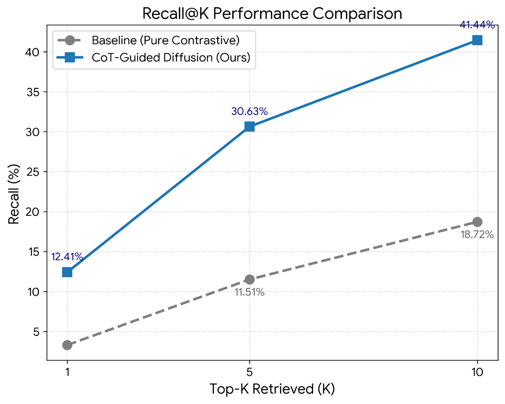
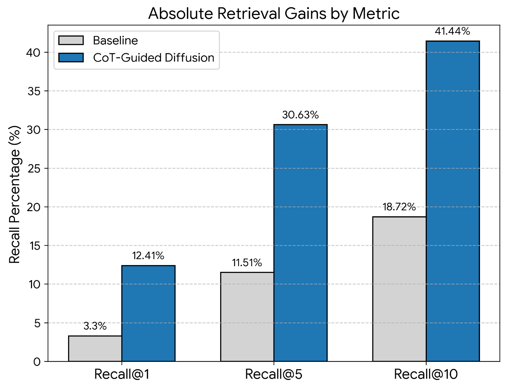

# CoT-Guided Generative Regularization for E-Commerce Search

<p align="left">
  
  
  
  
</p>

Traditional e-commerce search engines (like standard Two-Tower architectures) often suffer from "contrastive shortcuts"—they learn to match word frequencies rather than understanding physical geometry. This repository introduces a novel **Joint-Loss Generative Regularization** pipeline that forces text embeddings to learn visual physics, resulting in a **2.6x improvement in Top-5 Retrieval accuracy** over baseline models.

---

## 🧠 Motivation: The Modality Gap & Contrastive Shortcuts

Standard retrieval systems rely on pure Contrastive Loss to map text and images into a shared vector space. However, these models act as "bag-of-words" matchers. If a user searches for *"a white blender with a black handle,"* the model often incorrectly retrieves *"a black blender with a white handle."*

**The Hypothesis:** We can build a smarter search engine by treating retrieval as a Generative Task. By forcing a Text Encoder to guide a Diffusion model to literally *draw* the requested object pixel-by-pixel, the encoder is mathematically forced to learn spatial composition and physical geometry. Once trained, we discard the heavy image generator and use the "geometry-aware" text embeddings for blazing-fast K-NN vector searches.

## ⚙️ Architecture & Process

This pipeline solves the modality gap through three core components:

1. **Semantic Translation (Chain-of-Thought):** Raw human reviews are noisy. We use an LLM to extract a rigid reasoning structure: `Item: [Core Object]. Visual: [Physical Properties]. Intent: [Use Case].` This normalizes slang into clear physical instructions for the cross-attention heads.
2. **The Generative Bridge (LoRA + U-Net):** We freeze a base CLIP Text Encoder and inject Low-Rank Adaptation (LoRA) matrices ($r=8$). This allows the text embeddings to shift and learn CoT alignments by guiding a custom 2D-Conditioned U-Net to denoise images, bypassing massive VRAM requirements.
3. **Dual-Objective Joint Loss:** To prevent Catastrophic Forgetting (where the text encoder learns to draw but forgets how to search), we train the model to serve two masters simultaneously:
   * $\mathcal{L}_{Diffusion}$: Denoise the image (learn physical geometry).
   * $\mathcal{L}_{Contrastive}$: Stay anchored to the frozen CLIP Vision vector (retain searchability).

$$\mathcal{L}_{Total} = \mathcal{L}_{Diffusion} + \lambda \mathcal{L}_{Contrastive}$$

## 📊 Experimental Results

We evaluated the architecture on a strict Recall@K vector search against a database of 999 physical appliances. The baseline was established using an off-the-shelf Two-Tower CLIP architecture.

| Metric | Baseline (Pure Contrastive) | CoT-Guided Diffusion (Ours) | Relative Improvement |
| :--- | :--- | :--- | :--- |
| **Recall@1** | 3.30% | **12.41%** | <span style="color:green; font-weight:bold;">+276%</span> |
| **Recall@5** | 11.51% | **30.63%** | <span style="color:green; font-weight:bold;">+166%</span> |
| **Recall@10** | 18.72% | **41.44%** | <span style="color:green; font-weight:bold;">+121%</span> |

<br>
<p align="center">
  
  &nbsp; &nbsp;
  
</p>

---

## 📁 Repository Structure

```text
├── dataset.py               # Custom PyTorch Dataset for loading images & CoT JSON
├── evaluate_recall.py       # Inference script: Builds vector DB & calculates Recall@K
├── model.py                 # Core architecture: LoRA CLIP Text Encoder + 2D U-Net Bridge
├── scheduler.py             # DDPM Noise Scheduler implementation for the forward process
├── train.py                 # Training loop featuring Dual-Objective Joint Loss math
├── appliances_cot_ready.json # Preprocessed Chain-of-Thought dataset (required)
├── downloaded_images/       # Directory containing raw product images (required)
└── model_checkpoints/       # Directory where trained .pt weights are saved
```
## 🚀 Replication Guide

### 1. Prerequisites & Environment Setup
This pipeline was developed and tested on Python 3.10 with a CUDA-enabled GPU (minimum 12GB VRAM recommended; a batch size of 2 fits comfortably on 24GB VRAM).

Create a virtual environment and install the required dependencies:

```bash
# Create and activate virtual environment
python3.10 -m venv venv
source venv/bin/activate

# Install core machine learning libraries
pip install torch torchvision
pip install diffusers transformers peft huggingface_hub
pip install pillow tqdm requests urllib3 matplotlib
```
Note: Ensure diffusers, transformers, and huggingface_hub are fully up-to-date to avoid projection layer import errors.

### 2. Dataset Acquisition & Preparation
This project utilizes the **Amazon Reviews Dataset** (specifically the Appliances subset).

1. Download the raw item metadata and product images from the Amazon Reviews public repository.
2. Place the high-resolution product images into the `downloaded_images/` directory.
3. **Preprocessing:** Run the raw reviews through an LLM to extract the Chain-of-Thought structure. Save the output as `appliances_cot_ready.json` in the root directory. Expected format:

```json
{
  "B001...": {
    "cot_core": "mini fridge",
    "cot_visual": "white, square",
    "cot_intent": "storing dorm drinks",
    "id": "B001..."
  }
}
```
### 3. Training the Model
The `train.py` script handles the Joint-Loss training loop. It automatically scales images to 64x64 for the generative U-Net while maintaining 224x224 high-res anchors for the frozen CLIP Vision model to calculate the contrastive loss.

```bash
python train.py
```
Key Hyperparameters (adjustable inside train.py):

1.BATCH_SIZE = 2 (Adjust based on your GPU VRAM).

2.LAMBDA_CONTRASTIVE = 2.0 (Crucial for preventing modality gap collapse; balances generative and retrieval forces).

3.NUM_EPOCHS = 30 (Longer runs solidify the latent space).

4.LEARNING_RATE = 1e-4

Checkpoints will be saved automatically to the model_checkpoints/ directory after each epoch.

### 4. Evaluating Recall@K
Once training is complete, run the evaluation script. This script bypasses the U-Net, builds a K-NN vector database using the frozen Vision Encoder, and tests the Top-K retrieval accuracy using your newly trained LoRA Text Encoder.

```bash
python evaluate_recall.py
```
Running the Baseline: To reproduce the pure Contrastive Baseline for comparison (11.51% Recall@5), open evaluate_recall.py and comment out the custom_model.load_state_dict(...) line before running.

👨‍💻 Author
Ritik Verma M.S. in Computer Science, University at Buffalo (SUNY)
